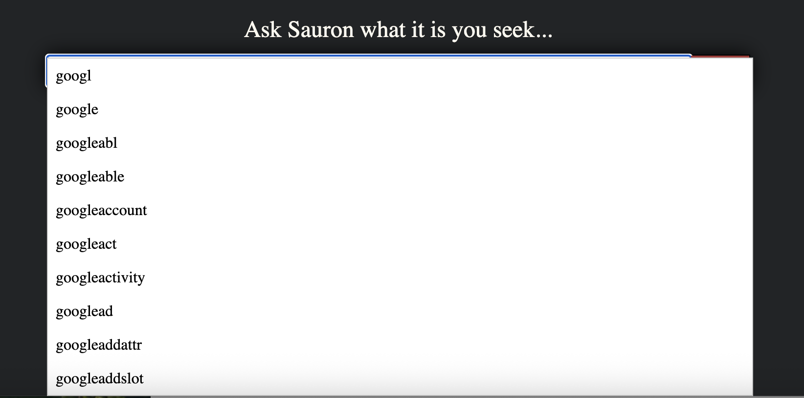

## Distributed-Search-Engine

## Table of Contents

- [Project Overview](#project-overview)
- [Project Structure](#project-structure)
- [To Compile and Run](#to-compile-and-run)
- [Additional Features Added](#additional-features-added)


# Project Overview
AskSauron is a distributed web search engine built in Java. It crawls the web, builds inverted indices with TF-IDF scoring, computes PageRank, and serves results through a web frontend. The system uses a distributed KVS (Key-Value Store) and Flame framework for parallel processing, supporting resume/checkpointing for all jobs. The frontend includes search suggestions, spellcheck, phrase search, cached page viewing, search result caching, cached page viewing, and preview snippets of search result.

# Project Structure
```
Root/
├── bin/                  
├── build/                
├── data/                 # KVS data storage
├── jar/                  
├── lib/                  
├── logs/                 
├── scrpit/               # Scripts, seeds.txt, blacklisted-urls.txt
├── src/cis5550/          
│   ├── external/         # External dependencies
│   ├── flame/            # Flame distributed framework
│   ├── frontend/         # Search frontend
│   ├── generic/          # Generic coordinator/worker base classes
│   ├── jobs/             # Crawler, Indexer, PageRank jobs
│   ├── kvs/              # Key-Value Store implementation
│   ├── resources/        # stopwords.txt
│   ├── tools/            
│   └── webserver/        # Web server framework
├── staticFiles/          # Static files for the frontend (HTML, CSS, images)
└── timestemp/            
```

# To Compile and Run

## 1. Build the Project

```bash
bash crawler/scrpit/build.sh
```
This will:
- Clean old build artifacts
- Compile all Java sources from `src/` to `build/`
- Create `crawler.jar` in `crawler/jar/` directory

#### Additional step: Clear old tables if rebuilding/restarting from scratch
This wipes tables such as pt-crawl, pt-index, pt-pageranks, pt-content for a full reset.
```bash
java -cp build cis5550.flame.FlameSubmit \
localhost:9000 crawler/jar/crawler.jar cis5550.jobs.ClearTables
```

## 2. Start All Services

```bash
bash crawler/scrpit/restart-all-services.sh
```
This starts:
- **KVS Coordinator** on port 8000
- **5 KVS Workers** on ports 8001-8005
- **Flame Coordinator** on port 9000
- **5 Flame Workers** on ports 9001-9005

All logs are saved to `crawler/logs/` directory.
All data is stored in the `data/` directory (in project root).

#### Additional step: Clear old tables if rebuilding/restarting from scratch
This wipes tables such as pt-crawl, pt-index, pt-pageranks, pt-content for a full reset.
```bash
java -cp build cis5550.flame.FlameSubmit \
localhost:9000 crawler/jar/crawler.jar cis5550.jobs.ClearTables
```

## 3. Run the Crawler

```bash
bash crawler/scrpit/run-crawler.sh https://www.cis.upenn.edu/ https://www.example.com/
```
or
```bash
bash crawler/scrpit/run-crawler.sh -f seeds.txt
```
or
```bash
bash crawler/scrpit/run-crawler.sh https://www.indiatimes.com
```

The `seeds.txt` file should be in `crawler/scrpit/` directory with one URL per line:
```
https://www.cis.upenn.edu/
https://www.example.com/
https://www.another-site.com/
```


## 4. Check Progress

```bash
bash crawler/scrpit/check-progress.sh
```
This displays:
- Overall stats (from original start time)
- Session stats (from current session start)
- Pages crawled
- Unique content count
- Overall crawl rate (pages/minute)
- Session crawl rate (pages/minute)

## 5. Stop All Services

```
bash crawler/scrpit/kill-all-services.sh
```

**Note:** The crawler automatically:
- Saves checkpoints to resume crawling
- Tracks session and overall crawl statistics
- Stores timestamps in `crawler/timestemp/`
- Writes blacklisted URLs to `crawler/scrpit/blacklisted-urls.txt`

## 6. Indexing

You must kill the crawler before running the indexer and pagerank jobs.

Start all services again and run the indexer:
```bash
bash crawler/scrpit/restart-all-services.sh
```

Run the indexing job

```bash
bash crawler/scrpit/run-indexer.sh
```

Run the indexer with different # of buckets (default is 100)
```bash
bash crawler/scrpit/run-indexer.sh 8
```
To pause indexing job, use the kill command (or killall java.)

After restarting workers, resume indexing job
```bash
bash crawler/scrpit/run-indexer.sh resume 8
```

## 7. Page Ranking
Run the pageranking job (default threshold: 0.001 | default % convergence: 100%)

```bash
bash crawler/scrpit/run-pagerank.sh
```
or with threshold + 95% convergence
```bash
bash crawler/scrpit/run-pagerank.sh 0.01 95
```
To pause/kill and resume Page Ranking
```bash
pkill -f "cis5550.jobs.PageRank"
   
cd /25fa-CIS5550-G09-AskSauron

# normal resume
java -Dhttp.keepAlive=false -cp "build:lib/*" cis5550.flame.FlameSubmit localhost:9000 crawler/jar/crawler.jar cis5550.jobs.PageRank resume

# resume with 0.001 threshold and 100% convergence
java -Dhttp.keepAlive=false -cp "build:lib/*" cis5550.flame.FlameSubmit localhost:9000 crawler/jar/crawler.jar cis5550.jobs.PageRank resume 0.001 100.0
```

### 8. Running the Frontend

After running the crawler, indexer, and pagerank, start the KVS coordinator/workers and the front end with this command:

If running on local machine:
```bash
bash crawler/scrpit/start-front-end.sh
```

If running on EC2:
```bash
sudo bash crawler/scrpit/start-front-end.sh prod
```

And access frontend via `http://localhost:8080`


# Additional Features Added

- [Phrase search](#phrase-search)
- [Search Suggestions](#search-suggestions)
- [Spellcheck](#spellcheck)
- [Visible Text vs Metadata Text Weighting](#visible-text-vs-metadata-text-weighting)
- [Crash-Resilient Start/Resume Functionality](#crash-resilient-startresume-functionality)
- [URL Blacklist & Calendar/Archive Loop Prevention](#url-blacklist--calendararchive-loop-prevention)
- [Porter Stemmer (third-party library OpenNLP)](#porter-stemmer-third-party-library-opennlp)
- [Cache Page Titles](#cache-page-titles)
- [Search Result Caching](#search-result-caching)
- [Cached Page Viewing and Search Result Preview Extraction with Term Highlight](#cached-page-viewing-and-search-result-preview-extraction-with-term-highlight)

## Phrase search

To test using the file provided TestPhraseSearch.java

```bash
bash crawler/scrpit/restart-all-services.sh
```

```bash
java -cp "bin:lib/*" cis5550.frontend.TestPhraseSearch
```

The expected output is:
```bash
http://doc1.com — score=1.80000 (tfidf=1.50000, pagerank=0.20000)
http://doc2.com — score=1.20000 (tfidf=1.00000, pagerank=0.20000)
```

| Term       | URL                                | Positions |
| ---------- | ---------------------------------- | --------- |
| **space**  | [http://doc1.com](http://doc1.com) | 1, 3      |
| **travel** | [http://doc1.com](http://doc1.com) | 2, 7      |
| **space**  | [http://doc2.com](http://doc2.com) | 1, 10     |
| **travel** | [http://doc2.com](http://doc2.com) | 5, 15     |

Each term contributes normalizedTf = 0.5, idf = 1.0, and baseline TF-IDF = 1.0 per doc.
Phrase boost multiplies TF-IDF by 1.5 for matching documents.

| URL      | Phrase boost? | TF-IDF after boost | PageRank | Final score = tfidf × (1 + pr) |
| -------- | ------------- | ------------------ | -------- | ------------------------------ |
| **doc1** |  yes         | 1.5 (× 1.5)        | 0.2      | 1.5 × 1.2 = **1.8**            |
| **doc2** |  no          | 1.0                | 0.2      | 1.0 × 1.2 = **1.2**            |


```bash
bash crawler/scrpit/start-front-end.sh
```

After visiting site enter in the search bar space travel

Results for: space travel
Back

http://doc1.com — score=1.80000 (tfidf=1.50000, pagerank=0.20000)
http://doc2.com — score=1.20000 (tfidf=1.00000, pagerank=0.20000)

### Search Suggestions

Access frontend via `https://asksauron.cis5550.net/`

Type a few keystrokes like (i.e.)`googl`



### Spellcheck

Access frontend via `https://asksauron.cis5550.net/`

Type in a misspelled word like (i.e.)`animel` hit `Seek`


### Visible Text vs Metadata Text Weighting
We enhanced the tokenizer to distinguish between visible page text and metadata (e.g., meta tags, scripts, styles). Metadata was disproportionately affecting rankings, so we weighted visible text at 1.0 and metadata at 0.001. The index stores these weights in the term frequency calculation, prioritizing content users actually see while still allowing metadata to contribute minimally when helpful.

### Crash-Resilient Start/Resume Functionality
Our crawler supports resuming from a previous state after crash or shutdown without duplicating work. Furthermore, it checks the persistent pt-crawl KVS table and skips URLs that were already processed. This allows for efficient recovery, making long crawls more robust in real-world distributed deployments.

### URL Blacklist & Calendar/Archive Loop Prevention
We integrated a URL blacklist which filters out known problematic domains or patterns before queuing. Also, we detected calendar/archive loops using regex heuristics and URL token repetition (e.g., /2025/01/02, /2025/01/03). This significantly reduced crawl loops and improved corpus diversity.

### Porter Stemmer (third-party library OpenNLP)
We integrated OpenNLP’s PorterStemmer for query and index-time normalization. Terms like "compute", "computing", and "computer" are stemmed to a shared root, improving recall across morphologically similar words. Therefore, stemming is applied consistently during both indexing and search query processing.

To download JAR file, go to https://archive.apache.org/dist/opennlp/opennlp-2.5.4/ and then download the file "apache-opennlp-2.5.4-bin.zip". Go to /apache-opennlp-2.5.4/lib/ to get the file "opennlp-tools-2.5.4.jar". Place into "/lib" folder of repo.

### Cache Page Titles
In order to reduce unnecessary KVS lookups and improve the frontend response time, we implemented a page title cache in the frontend. Once a title is retrieved for a URL from the pt-crawl table, it’s stored in memory. We used subsequent queries avoid redundant lookups which boosting responsiveness especially on paginated results.

### Search Result Caching
We used search queries and their results that are cached in memory in the frontend using a simple LRU cache. This allows repeated queries (like "space travel") to bypass expensive TF-IDF and phrase-matching logic entirely. Therefore, the cache entries store search results with scores and ranks and get invalidated only on frontend restart.

### Cached Page Viewing and Search Result Preview Extraction with Term Highlight
We extracted preview snippets from cached HTML pages by stripping tags and scripts, finding term windows that contain the most query terms, and using the `<mark>` HTML tags. This is significant because this preview shows users where their query matched in the page and why a result was ranked highly which improves usability as well as transparency.
